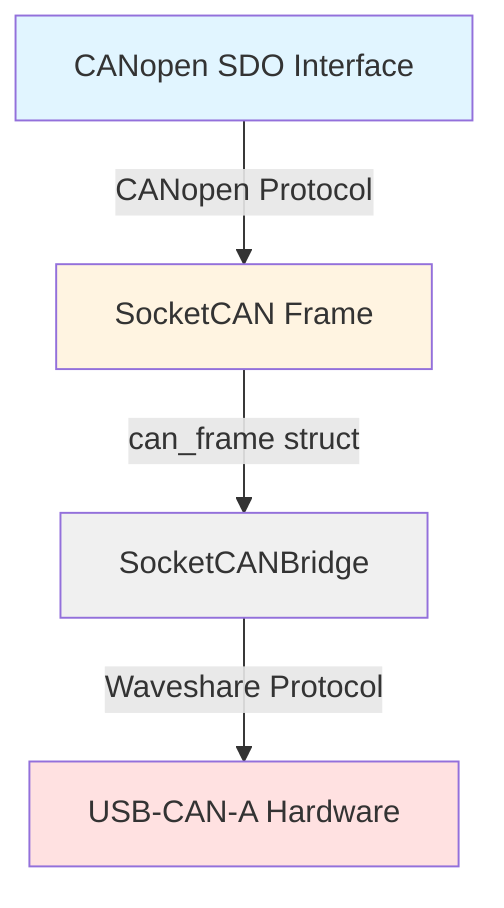

```mermaid
graph TB
    A[CANopen SDO Interface] -->|CANopen Protocol| B[SocketCAN Frame]
    B -->|can_frame struct| C[SocketCANBridge]
    C -->|Waveshare Protocol| D[USB-CAN-A Hardware]
    
    style A fill:#e1f5ff
    style B fill:#fff4e1
    style C fill:#f0f0f0
    style D fill:#ffe1e1
```