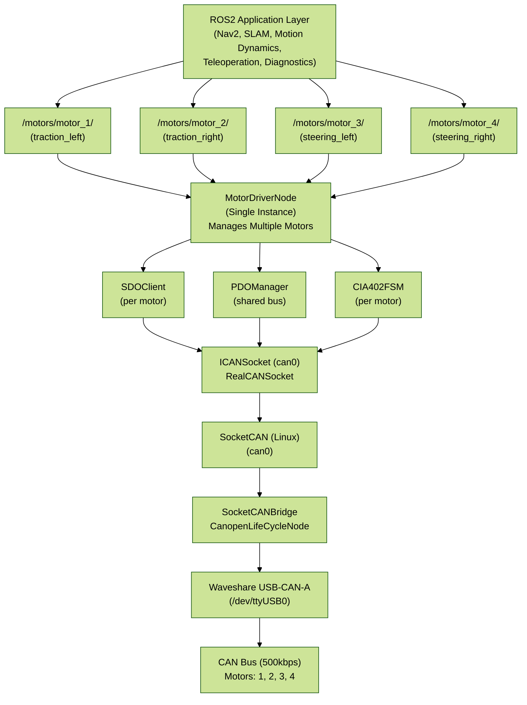
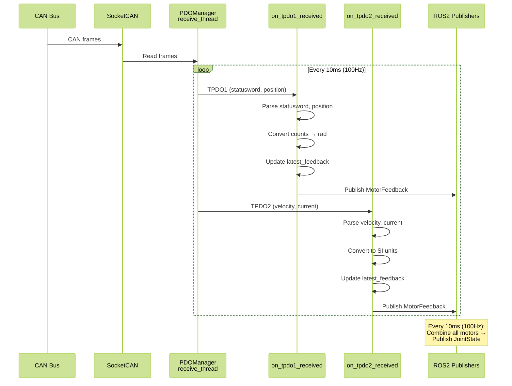
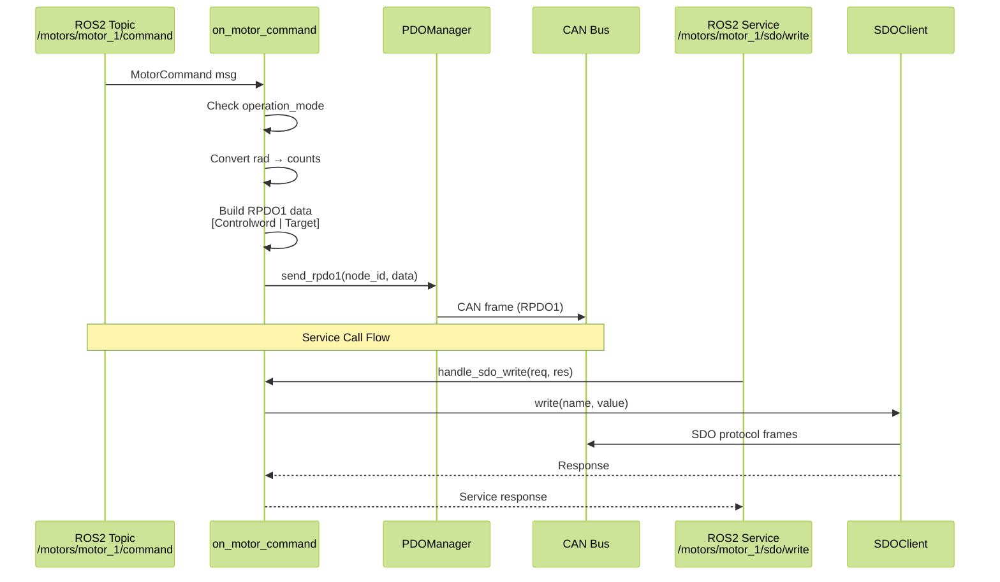
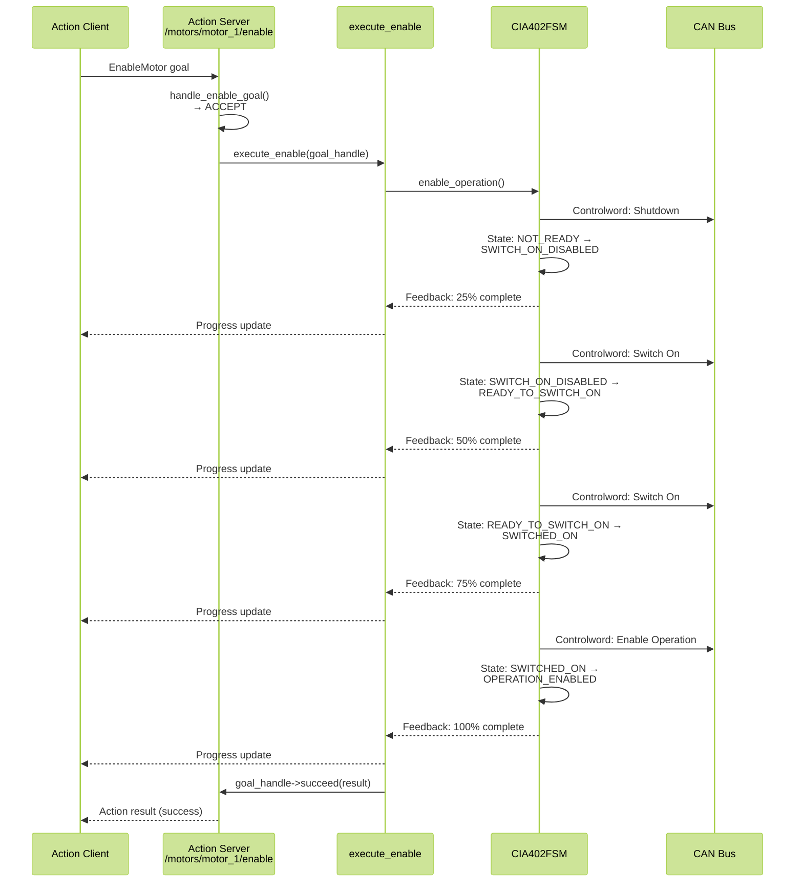

# MotorDriverNode Architecture Design

> **Author**: effibot (andrea.efficace1@gmail.com)  
> **Date**: 2025-11-10  
> **Purpose**: Architecture specification for ROS2 motor driver node wrapping waveshare_cpp CANopen library

## System Architecture Overview



## Component Architecture

### MotorDriverNode Class Structure

```cpp
class MotorDriverNode : public rclcpp::Node {
public:
    explicit MotorDriverNode(const rclcpp::NodeOptions& options);
    ~MotorDriverNode();

private:
    // =====================================================================
    // Core CANopen Components (from waveshare_cpp)
    // =====================================================================
    
    struct MotorInstance {
        uint8_t node_id;
        std::string name;
        
        // CANopen components (per motor)
        std::unique_ptr<canopen::SDOClient> sdo_client;
        std::unique_ptr<canopen::CIA402FSM> fsm;
        canopen::ObjectDictionary dictionary;
        
        // Unit conversion parameters
        double counts_per_revolution;
        double gear_ratio;
        double torque_constant_nm_per_a;
        
        // State tracking
        std::atomic<bool> initialized{false};
        std::atomic<bool> enabled{false};
        
        // ROS2 Publishers (per motor)
        rclcpp::Publisher<MotorFeedback>::SharedPtr pub_feedback;
        rclcpp::Publisher<MotorStatus>::SharedPtr pub_status;
        
        // ROS2 Subscribers (per motor)
        rclcpp::Subscription<MotorCommand>::SharedPtr sub_command;
        
        // ROS2 Services (per motor)
        rclcpp::Service<SDORead>::SharedPtr srv_sdo_read;
        rclcpp::Service<SDOWrite>::SharedPtr srv_sdo_write;
        rclcpp::Service<SetOperationMode>::SharedPtr srv_set_mode;
        rclcpp::Service<GetMotorInfo>::SharedPtr srv_get_info;
        
        // ROS2 Action Servers (per motor)
        rclcpp_action::Server<EnableMotor>::SharedPtr action_enable;
        rclcpp_action::Server<ResetFault>::SharedPtr action_reset_fault;
        rclcpp_action::Server<MoveToPosition>::SharedPtr action_move;
        
        // Latest feedback data (for action servers)
        MotorFeedback latest_feedback;
        std::mutex feedback_mutex;
    };
    
    // CAN socket (shared by all motors)
    std::shared_ptr<waveshare::ICANSocket> can_socket_;
    
    // PDO Manager (shared - single receive thread for all motors)
    std::unique_ptr<canopen::PDOManager> pdo_manager_;
    
    // Motor instances (4 motors: 2 traction + 2 steering)
    std::map<uint8_t, std::unique_ptr<MotorInstance>> motors_;
    
    // Combined publishers
    rclcpp::Publisher<sensor_msgs::msg::JointState>::SharedPtr pub_joint_states_;
    rclcpp::Publisher<PDOStatistics>::SharedPtr pub_pdo_stats_;
    
    // =====================================================================
    // Timers
    // =====================================================================
    
    rclcpp::TimerBase::SharedPtr timer_sync_;          // SYNC message (10ms = 100Hz)
    rclcpp::TimerBase::SharedPtr timer_diagnostics_;   // Diagnostics (1Hz)
    
    // =====================================================================
    // Initialization Methods
    // =====================================================================
    
    void load_parameters();
    void initialize_can_socket();
    void initialize_motors();
    void initialize_pdo_manager();
    void setup_publishers();
    void setup_timers();
    
    // =====================================================================
    // PDO Callbacks (per motor)
    // =====================================================================
    
    void on_tpdo1_received(uint8_t node_id, const can_frame& frame);
    void on_tpdo2_received(uint8_t node_id, const can_frame& frame);
    
    // =====================================================================
    // Command Callbacks (per motor)
    // =====================================================================
    
    void on_motor_command(uint8_t node_id, const MotorCommand::SharedPtr msg);
    
    // =====================================================================
    // Service Callbacks (per motor)
    // =====================================================================
    
    void handle_sdo_read(
        uint8_t node_id,
        const SDORead::Request::SharedPtr request,
        SDORead::Response::SharedPtr response);
    
    void handle_sdo_write(
        uint8_t node_id,
        const SDOWrite::Request::SharedPtr request,
        SDOWrite::Response::SharedPtr response);
    
    void handle_set_operation_mode(
        uint8_t node_id,
        const SetOperationMode::Request::SharedPtr request,
        SetOperationMode::Response::SharedPtr response);
    
    void handle_get_motor_info(
        uint8_t node_id,
        const GetMotorInfo::Request::SharedPtr request,
        GetMotorInfo::Response::SharedPtr response);
    
    // =====================================================================
    // Action Server Callbacks (per motor)
    // =====================================================================
    
    rclcpp_action::GoalResponse handle_enable_goal(
        uint8_t node_id,
        const rclcpp_action::GoalUUID& uuid,
        std::shared_ptr<const EnableMotor::Goal> goal);
    
    rclcpp_action::CancelResponse handle_enable_cancel(
        uint8_t node_id,
        const std::shared_ptr<rclcpp_action::ServerGoalHandle<EnableMotor>> goal_handle);
    
    void handle_enable_accepted(
        uint8_t node_id,
        const std::shared_ptr<rclcpp_action::ServerGoalHandle<EnableMotor>> goal_handle);
    
    void execute_enable(
        uint8_t node_id,
        const std::shared_ptr<rclcpp_action::ServerGoalHandle<EnableMotor>> goal_handle);
    
    // Similar for ResetFault and MoveToPosition actions...
    
    // =====================================================================
    // Timer Callbacks
    // =====================================================================
    
    void send_sync_timer_callback();      // Send SYNC at 100Hz
    void publish_diagnostics_callback();  // Publish stats at 1Hz
    
    // =====================================================================
    // Helper Methods
    // =====================================================================
    
    // Unit conversions
    double counts_to_rad(uint8_t node_id, int32_t counts);
    int32_t rad_to_counts(uint8_t node_id, double rad);
    double counts_per_sec_to_rad_per_sec(uint8_t node_id, int32_t counts_per_sec);
    double current_to_torque(uint8_t node_id, int16_t current_ma);
    
    // Message building
    MotorFeedback build_motor_feedback(
        uint8_t node_id,
        const can_frame& tpdo1,
        const can_frame& tpdo2);
    
    sensor_msgs::msg::JointState build_joint_state_msg();
    
    // State queries
    bool is_motor_operational(uint8_t node_id);
    std::string get_motor_state_string(uint8_t node_id);
};
```

## Data Flow Diagrams

### TPDO Reception Flow (100Hz)



### Command Flow (On-demand)



### Action Flow (Enable Motor)



## Thread Safety

### Shared Resources

| Resource                      | Access Pattern                            | Protection                 |
| ----------------------------- | ----------------------------------------- | -------------------------- |
| `can_socket_`                 | Multiple motors read/write                | Mutex in ICANSocket        |
| `pdo_manager_`                | Single receive thread                     | Internal atomics           |
| `motors_[id].latest_feedback` | Write: PDO callback, Read: Action servers | `feedback_mutex`           |
| `motors_[id].sdo_client`      | Service callbacks only                    | No mutex (single-threaded) |
| `motors_[id].fsm`             | Action callbacks only                     | No mutex (single-threaded) |

### ROS2 Threading Model

- **Main thread**: Initialization, timers
- **Subscription callbacks**: Executor thread pool (default: single-threaded)
- **Service callbacks**: Executor thread pool
- **Action callbacks**: Executor thread pool
- **PDO receive thread**: Dedicated thread in PDOManager

**Strategy**: Use ROS2 MultiThreadedExecutor with 4 threads to handle concurrent callbacks.

## Parameter Structure

```yaml
motor_driver:
  ros__parameters:
    # CAN Interface
    can_interface: "can0"
    
    # Motor configurations
    motors:
      motor_1:
        node_id: 1
        name: "traction_motor_left"
        type: "traction"
        config_file: "config/motor_config.json"
        counts_per_revolution: 10000.0
        gear_ratio: 50.0
        torque_constant_nm_per_a: 0.05
        
      motor_2:
        node_id: 2
        name: "traction_motor_right"
        type: "traction"
        config_file: "config/motor_config.json"
        counts_per_revolution: 10000.0
        gear_ratio: 50.0
        torque_constant_nm_per_a: 0.05
        
      motor_3:
        node_id: 3
        name: "steering_motor_left"
        type: "steering"
        config_file: "config/motor_config.json"
        counts_per_revolution: 10000.0
        gear_ratio: 100.0
        torque_constant_nm_per_a: 0.03
        
      motor_4:
        node_id: 4
        name: "steering_motor_right"
        type: "steering"
        config_file: "config/motor_config.json"
        counts_per_revolution: 10000.0
        gear_ratio: 100.0
        torque_constant_nm_per_a: 0.03
    
    # PDO Configuration
    pdo:
      sync_rate_hz: 100.0             # SYNC message frequency
      tpdo_timeout_ms: 100            # TPDO timeout
      
    # Publishing rates
    joint_state_rate_hz: 100.0        # Combined JointState
    diagnostics_rate_hz: 1.0          # Statistics publishing
    
    # Timeouts
    sdo_timeout_ms: 1000
    state_transition_timeout_ms: 1000
```

## Topic/Service/Action Namespace Structure

```
/motors/
  ├── motor_1/                        # Traction Left (node_id=1)
  │   ├── feedback                    # MotorFeedback (100Hz)
  │   ├── command                     # MotorCommand (subscribe)
  │   ├── status                      # MotorStatus (10Hz)
  │   ├── sdo/
  │   │   ├── read                    # Service
  │   │   └── write                   # Service
  │   ├── set_operation_mode          # Service
  │   ├── get_motor_info              # Service
  │   ├── enable                      # Action
  │   ├── reset_fault                 # Action
  │   └── move_to_position            # Action
  │
  ├── motor_2/                        # Traction Right (node_id=2)
  │   └── ... (same structure)
  │
  ├── motor_3/                        # Steering Left (node_id=3)
  │   └── ... (same structure)
  │
  └── motor_4/                        # Steering Right (node_id=4)
      └── ... (same structure)

/joint_states                         # sensor_msgs/JointState (all motors)
/motors/pdo_statistics                # PDOStatistics (1Hz)
/motors/diagnostics                   # diagnostic_msgs/DiagnosticArray (1Hz)
```

## Initialization Sequence

1. **Load Parameters** (motor configs, CAN interface, rates)
2. **Open CAN Socket** (`can0`)
3. **Initialize PDO Manager** (start receive thread)
4. **For Each Motor**:
   - Load ObjectDictionary from JSON
   - Create SDOClient
   - Create CIA402FSM
   - Setup publishers (feedback, status)
   - Setup subscribers (command)
   - Setup services (SDO, mode, info)
   - Setup action servers (enable, reset, move)
   - Register TPDO callbacks with PDOManager
5. **Start Timers** (SYNC at 100Hz, diagnostics at 1Hz)
6. **Ready** - Node fully operational

## Shutdown Sequence

1. **Stop Timers**
2. **Disable All Motors** (via CIA402FSM)
3. **Stop PDO Manager** (stop receive thread)
4. **Close CAN Socket**
5. **Cleanup Resources**

---

**Next**: Part B - Create parameter files for motor configurations
